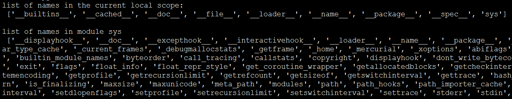

# 模块
模块是一个包含函数和变量的文件，其后缀名是.py，模块可以被别的程序引入，以使用该模块中的函数等功能。python的标准库就是一个个的模块。

示例：使用标准库[sys](https://docs.python.org/3/library/sys.html)
```python
#!/usr/bin/python
import sys
print(sys.path)
```
## 模块导入方法
### 使用`import`语句

> import module1[,module2[,...moduleN]

示例：

```python
#!/usr/bin/python
import sys
print(sys.path)
```

### 使用from ... import语句
此时，导入的函数或变量无需使用`modname.name`形式，导入的函数或变量和当前文件有相同的命名空间。

> from modname import name1[, name2[, ... nameN]]

示例：
```python
#!/usr/bin/python
from sys import path
print(path,"\n")
```


### 使用from ... import * 语句
将模块内的所有函数和变量导入，不推荐使用

> from modname import *

## 查看符号表
通过内置函数`dir()`可以查看符号表,若`dir()`没有参数，则返回当前域的符号表，若参数为某个模块，则返回此模块的符号表

```python
#!/usr/bin/python
import sys 
print("list of names in the current local scope:\n",dir(),"\n")
print("list of names in module sys\n",dir(sys))
```




## 参考
[菜鸟教程](http://www.runoob.com/python3/python3-module.html)

